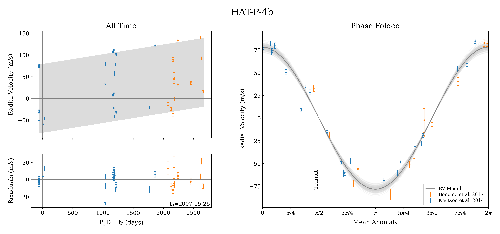

.. _example-rv-trends:

********************************
Long-Term Radial Velocity Trends
********************************
This example demonstrates an OrbDot reproduction of the radial velocity analyses of the Hot Jupiter host stars HAT-P-4 and HAT-P-22 from "The GAPS Programme with HARPS-N at TNG XIV" by :cite:t:`Bonomo2017` and "Friends of Hot Jupiters I" by :cite:t:`Knutson2014`.

In both studies, the authors detect a statistically significant linear trend in the radial velocity measurements of HAT-P-4, and :cite:author:`Bonomo2017`, combining their data with that of :cite:author:`Knutson2014`, detected a quadratic trend in the observations of HAT-P-22. In both cases, these long-term trends are suggestive of an outer planetary companion.

For both Hot Jupiter systems, we compile the observations from :cite:author:`Bonomo2017` (HARPS) and :cite:author:`Knutson2014` (HIRES) and fit the following four models:

 1. A circular orbit
 2. An eccentric orbit
 3. A circular orbit with a long-term linear trend
 4. A circular orbit with a long-term quadratic trend

The ``Analyzer`` class is then used to compare the Bayesian evidences and constrain properties of the possible outer companion. There are two Python scripts for this example that can be run without modifications, which may be found in the ``examples/example_hat-p-4.py`` and ``examples/example_hat-p-22.py`` files.

Setup
=====
Before running the model fits, we need to compile the radial velocity measurements in separate :ref:`data files <data-files>`, populate a star-planet :ref:`info file <info-file>` for each system, and create two different :ref:`settings files <settings-file>`.

Data
----
The radial velocity measurements are taken from :cite:author:`Bonomo2017` and :cite:author:`Knutson2014` and saved in the files: ``examples/data/HAT-P-4_rvs.txt`` and ``examples/data/HAT-P-22_rvs.txt``.

.. admonition:: Partial table of HAT-P-4 RV data:
  :class: dropdown

  .. code-block:: text

    Time            Velocity    Error     Source
    2454186.9827888 54.709      2.429     "Knutson et al. 2014"
    2454187.1099758 51.295      2.126     "Knutson et al. 2014"
    2454188.0435063 -72.774     1.444     "Knutson et al. 2014"
    2454189.0432964 -54.59      1.605     "Knutson et al. 2014"

    ...

    2456701.6308712 -1389.77    3.54      "Bonomo et al. 2017"
    2456861.4249985 -1284.53    2.99      "Bonomo et al. 2017"
    2456877.4171316 -1333.45    3.62      "Bonomo et al. 2017"
    2456909.3412775 -1410.06    2.66      "Bonomo et al. 2017"

.. admonition:: Partial table of HAT-P-22 RV data:
  :class: dropdown

  .. code-block:: text

    Time            Velocity    Error     Source
    2454928.9501093 152.732     1.144     "Knutson et al. 2014"
    2454954.8821362 250.651     1.303     "Knutson et al. 2014"
    2454955.8003862 44.387      1.536     "Knutson et al. 2014"
    2454956.9646002 -309.624    1.430     "Knutson et al. 2014"

    ...

    2457069.6071593 12612.43    4.54      "Bonomo et al. 2017"
    2457472.4641639 12499.72    1.59      "Bonomo et al. 2017"
    2457526.4654365 12337.50    1.03      "Bonomo et al. 2017"
    2457549.3943908 12424.18    1.08      "Bonomo et al. 2017"

Note that the data from the two studies are differentiated by the ``Source`` column. This is very important, as the instrument-dependent parameters ``"v0"`` and ``"jit"`` are automatically separated in the fitting routines. The first three characters of every unique ``Source`` column entry are saved as an identifier, in this case ``"Bon"`` for ``"Bonomo et al. (2017)"`` and ``"Knu"`` for ``"Knutson et al. (2014)"``.

System Info Files
-----------------
The :ref:`system info files <info-file>` are saved as: ``examples/info_files/HAT-P-4_info.json`` and ``examples/info_files/HAT-P-22_info.json``.

The star and planet masses, stellar radius, and orbital ephemeris are the same as the values used in :cite:author:`Bonomo2017`, but the unit of the planets' masses have been converted from Jupiter masses to Earth masses to adhere to the OrbDot convention. The sky coordinates and discovery year are not necessary for the analysis, but are useful for additional context.

.. admonition:: HAT-P-4 system information file
  :class: dropdown

    .. code-block:: JSON

        {
          "_comment1": "HAT-P-4 System Info",

              "star_name": "HAT-P-4",
              "RA": "15h19m57.89s",
              "DEC": "+36d13m46.36s",
              "discovery_year": 2007,

          "_comment2": "Star Properties",

              "M_s [M_sun]": 1.248,
              "R_s [R_sun]": 1.596,

          "_comment3": "Planet Properties",

              "planets": ["b"],
              "M_p [M_earth]": [206.957],

          "_comment4": "Model Parameters",

              "_comment4_1": "Orbital Elements",

              "t0 [BJD_TDB]": [2454245.81521],
              "P [days]": [3.0565254]
        }

.. admonition:: HAT-P-22 system information file
  :class: dropdown

    .. code-block:: JSON

        {
          "_comment1": "HAT-P-22 System Info",

              "star_name": "HAT-P-22",
              "RA": "10h22m43.55s",
              "DEC": "+50d07m43.36s",
              "discovery_year": 2010,

          "_comment2": "Star Properties",

              "M_s [M_sun]": 0.916,
              "R_s [R_sun]": 1.040,

          "_comment3": "Planet Properties",

              "planets": ["b"],
              "M_p [M_earth]": [690.492],

          "_comment4": "Model Parameters",

              "_comment4_1": "Orbital Elements",

              "t0 [BJD_TDB]": [2454930.22077],
              "P [days]": [3.21222]
        }

Settings Files
--------------
The :ref:`settings files <settings-file>` are saved as: ``examples/settings_files/HAT-P-4_settings.json`` and ``examples/settings_files/HAT-P-22_settings.json``.

.. admonition:: HAT-P-4 b settings file
  :class: dropdown

    .. code-block:: JSON

        {
          "_comment1": "HAT-P-4 b Settings",

          "_comment2": "Input Files",

              "main_save_dir": "results/",
              "system_info_file": "info_files/HAT-P-4_info.json",

          "_comment3": "Model Fits",

               "RV_fit": {
                 "save_dir": "rv_fits/",
                 "data_file": "data/HAT-P-4b_rvs.txt",
                 "data_delimiter": " ",
                 "sampler": "nestle",
                 "n_live_points": 1000,
                 "evidence_tolerance": 0.01
               },

          "_comment4": "Priors",

               "prior": {
                 "t0": ["gaussian", 2454245.81521, 0.001],
                 "P0": ["gaussian", 3.0565254, 0.00001],
                 "ecosw": ["uniform", -0.1, 0.1],
                 "esinw": ["uniform", -0.1, 0.1],
                 "K": ["uniform", 50.0, 100.0],
                 "v0": [["uniform", -2000.0, -1000.0], ["uniform", -100.0, 100.0]],
                 "jit": ["log", -1, 2],
                 "dvdt": ["uniform", -0.1, 0.1],
                 "ddvdt": ["uniform", -0.001, 0.001]
               }
        }

.. admonition:: HAT-P-22 b settings file
  :class: dropdown

    .. code-block:: JSON

        {
          "_comment1": "HAT-P-22 b Settings",

          "_comment2": "Input Files",

              "main_save_dir": "results/",
              "system_info_file": "info_files/HAT-P-22_info.json",

          "_comment3": "Model Fits",

               "RV_fit": {
                 "save_dir": "rv_fits/",
                 "data_file": "data/HAT-P-22b_rvs.txt",
                 "data_delimiter": " ",
                 "sampler": "nestle",
                 "n_live_points": 1000,
                 "evidence_tolerance": 0.01
               },

          "_comment4": "Priors",

               "prior": {
                 "t0": ["gaussian", 2454930.22077, 0.001],
                 "P0": ["gaussian", 3.21222, 0.00001],
                 "ecosw": ["uniform", -0.1, 0.1],
                 "esinw": ["uniform", -0.1, 0.1],
                 "K": ["uniform", 300.0, 330.0],
                 "v0": [["uniform", 12000.0, 13000.0], ["uniform", -100.0, 100.0]],
                 "jit": ["log", -1, 2],
                 "dvdt": ["uniform", -0.1, 0.1],
                 "ddvdt": ["uniform", -0.001, 0.001]
               }
        }

The first part of the settings file specifies the path name for the system information file with the ``"system_info_file"`` key and the base directory for saving the results with the ``"main_save_dir"`` key. For example,

.. code-block:: JSON

    {
      "_comment1": "HAT-P-4 b Settings",

      "_comment2": "Input Files",

          "main_save_dir": "results/",
          "system_info_file": "info_files/HAT-P-4_info.json",
    ...

The next section(s) of the files are specific to the model fitting. Because we are only fitting radial velocity data in this example, we only need to provide an entry for the ``"RV_fit"`` key. The value for ``"RV_fit"`` is a dictionary that points to and describes the data file (``"data_file"`` and ``"data_delimiter"``), provides a sub-directory for saving the RV model fit results (``"save_dir"``), and specifies the desired sampling package (``"sampler"``), number of live points (``"n_live_points"``) and evidence tolerance (``"evidence_tolerance"``). For this example, the ``"nestle"`` sampler has been specified with 1000 live points and an evidence tolerance of 0.01, which should balance well-converged results with a short run-time. For example,

.. code-block:: JSON

    ...

      "_comment3": "Model Fits",

           "RV_fit": {
             "save_dir": "rv_fits/",
             "data_file": "data/HAT-P-4b_rvs.txt",
             "data_delimiter": " ",
             "sampler": "nestle",
             "n_live_points": 1000,
             "evidence_tolerance": 0.01
           },
    ...

The remaining portion of the settings file is for the ``"prior"`` dictionary, which defines the :ref:`prior distributions <priors>` for the model parameters. We need only populate this with the parameters that are to be included in the model fits, which in this case are the reference transit mid-time ``"t0"``, orbital period ``"P0"``, RV semi-amplitude ``"K"``, systemic velocity ``"v0"``, jitter ``"jit"``, first-order acceleration term ``"dvdt"``, second-order acceleration term ``"ddvdt"``, and the coupled parameters ``"ecosw"`` and ``"esinw"``.

.. code-block:: JSON

    ...

      "_comment4": "Priors",

           "prior": {
             "t0": ["gaussian", 2454245.81521, 0.001],
             "P0": ["gaussian", 3.0565254, 0.00001],
             "ecosw": ["uniform", -0.1, 0.1],
             "esinw": ["uniform", -0.1, 0.1],
             "K": ["uniform", 50.0, 100.0],
             "v0": [["uniform", -2000.0, -1000.0], ["uniform", -100.0, 100.0]],
             "jit": ["log", -1, 2],
             "dvdt": ["uniform", -0.1, 0.1],
             "ddvdt": ["uniform", -0.001, 0.001]
           }
    }

------------

HAT-P-4 b
=========
In the following sections we will fit the following four models to the HAT-P-4 radial velocities:

 1. A circular orbit
 2. An eccentric orbit
 3. A circular orbit with a long-term linear trend
 4. A circular orbit with a long-term quadratic trend

and compare the results to those of :cite:author:`Bonomo2017` and :cite:author:`Knutson2014`.

The first step is to import the :class:`~orbdot.star_planet.StarPlanet` and :class:`~orbdot.analysis.Analyzer` classes, and then to create an instance of :class:`~orbdot.star_planet.StarPlanet` that represents HAT-P-4 b:

.. code-block:: python

    from orbdot.star_planet import StarPlanet
    from orbdot.analysis import Analyzer

    # initialize the StarPlanet class
    hatp4 = StarPlanet('settings_files/HAT-P-4_settings.json')

Model Fits
----------
To run the model fitting routines, the :meth:`~orbdot.radial_velocity.RadialVelocity.run_rv_fit` method is called with the free parameters given in a list of strings. In this example we are not considering a secular evolution of the orbit of HAT-P-4 b, so we may ignore the ``model`` argument, for which the default is already ``"constant"``.

The following code snippet fits the radial velocity data to both circular and eccentric orbit models, without including any long-term trends (ie. Models 1 and 2). Notice how the ``file_suffix`` argument is used to differentiate the fits, which is needed because both fits use the stable-orbit model (ie. ``model="constant"`` in both cases).

.. code-block:: python

    # run an RV model fit of a circular orbit
    fit_circular = hatp4.run_rv_fit(['t0', 'P0', 'K', 'v0', 'jit'], file_suffix='_circular')

    # run an RV model fit of an eccentric orbit
    fit_eccentric = hatp4.run_rv_fit(['t0', 'P0', 'K', 'v0', 'jit', 'ecosw', 'esinw'], file_suffix='_eccentric')

Once the model fits are complete, the output files are found in the directory that was given in the settings file, in this case: ``examples/results/HAT-P-4/rv_fits/``. The dropdown menus below show the contents of the ``*_summary.txt`` files, which provide a convenient summary of the results.

.. admonition:: Summary of the HAT-P-4 circular orbit RV fit:
  :class: dropdown

    .. code-block:: text

        Stats
        -----
        Sampler: nestle
        Free parameters: ['t0' 'P0' 'K' 'jit_Bon' 'jit_Knu' 'v0_Bon' 'v0_Knu']
        log(Z) = -161.6 ± 0.11
        Run time (s): 45.72
        Num live points: 1000
        Evidence tolerance: 0.01
        Eff. samples per second: 143

        Results
        -------
        t0 = 2454245.8152624257 + 0.0009866193868219852 - 0.0009959368035197258
        P0 = 3.0565302909522645 + 9.628405058137446e-06 - 9.895912548518737e-06
        K = 82.06286595515182 + 3.636437866797266 - 3.5836186854552494
        jit_Bon = 11.629707025283082 + 3.5463073564528464 - 2.443087165624192
        jit_Knu = 16.71881495581764 + 2.9563546169961263 - 2.2744944889660133
        v0_Bon = -1372.8357363701698 + 3.388195113018128 - 3.6054291761086006
        v0_Knu = -3.3045293275562955 + 3.485370579544684 - 3.6356081430756264

        Fixed Parameters
        ----------------
        e0 = 0.0
        w0 = 0.0
        dvdt = 0.0
        ddvdt = 0.0

.. admonition:: Summary of the HAT-P-4 eccentric orbit RV fit:
  :class: dropdown

    .. code-block:: text

        Stats
        -----
        Sampler: nestle
        Free parameters: ['t0' 'P0' 'K' 'ecosw' 'esinw' 'jit_Bon' 'jit_Knu' 'v0_Bon' 'v0_Knu']
        log(Z) = -161.7 ± 0.11
        Run time (s): 65.53
        Num live points: 1000
        Evidence tolerance: 0.01
        Eff. samples per second: 108

        Results
        -------
        t0 = 2454245.8152229683 + 0.0009705857373774052 - 0.0009963056072592735
        P0 = 3.056527513515759 + 9.656250686163048e-06 - 9.780042444784698e-06
        K = 82.17777294452569 + 3.381811270178929 - 3.6279815330479153
        ecosw = 0.034892127746802115 + 0.022552857878186054 - 0.02302364267425531
        esinw = 0.038307251257365255 + 0.042992953621421165 - 0.06371500785915496
        jit_Bon = 10.323219819534698 + 3.3554942353175505 - 2.545094552645458
        jit_Knu = 17.15561643714779 + 3.142214283254269 - 2.37897495654156
        v0_Bon = -1373.1588878990692 + 3.2876410606945683 - 3.1501496916082488
        v0_Knu = -5.502898434484123 + 3.9220421476232925 - 3.977647410826174
        e (derived) = 0.05181607933445052 + 0.035226179365903935 - 0.04958989120385178
        w0 (derived) = 0.8320194447723681 + 0.6447556063522455 - 0.8907987268991955

        Fixed Parameters
        ----------------
        e0 = 0.0
        w0 = 0.0
        dvdt = 0.0
        ddvdt = 0.0

The best-fit parameter values are shown with uncertainties derived from the 68% confidence intervals, as well as some other useful information about the model fit. Notice how the instrument-dependent free parameters, ``"v0"`` and ``"jit"``, were automatically split into different variables for each data source.

Though the Bayesian evidences for the two models, ``log(Z) = -161.6`` and ``log(Z) = -161.7``, are indistinguishable, the result of the eccentric orbit fit are consistent with that of a circular orbit. Next, we will focus on the circular orbit model for HAT-P-4 b, but this time including long-term linear and quadratic trends (Models 3 and 4) with the ``"dvdt"`` and ``"ddvdt"`` parameters.

.. code-block:: python

    # run an RV model fit of a circular orbit with a linear trend
    fit_linear = hatp4.run_rv_fit(['t0', 'P0', 'K', 'v0', 'jit', 'dvdt'], file_suffix='_linear')

    # run an RV model fit of a circular orbit with a quadratic trend
    fit_quadratic = hatp4.run_rv_fit(['t0', 'P0', 'K', 'v0', 'jit', 'dvdt', 'ddvdt'], file_suffix='_quadratic')

.. admonition:: Summary of the HAT-P-4 linear trend RV fit:
  :class: dropdown

    .. code-block:: text

        Stats
        -----
        Sampler: nestle
        Free parameters: ['t0' 'P0' 'K' 'dvdt' 'jit_Bon' 'jit_Knu' 'v0_Bon' 'v0_Knu']
        log(Z) = -150.66 ± 0.12
        Run time (s): 70.41
        Num live points: 1000
        Evidence tolerance: 0.01
        Eff. samples per second: 100

        Results
        -------
        t0 = 2454245.81522837 + 0.0009849066846072674 - 0.0009744581766426563
        P0 = 3.056529543843015 + 9.569140289933387e-06 - 1.007271078989902e-05
        K = 78.3086497824561 + 2.572101055717525 - 2.61625636995025
        dvdt = 0.02241330403154132 + 0.003287841602584482 - 0.003331223649246904
        jit_Bon = 9.390728614556656 + 3.0215564116133464 - 2.339331773950705
        jit_Knu = 9.704389866640525 + 1.8553617338907227 - 1.4590870624721095
        v0_Bon = -1425.332056278457 + 8.33833824287558 - 8.277787660167178
        v0_Knu = -22.073742328531253 + 3.538835997927368 - 3.4236922753468555

        Fixed Parameters
        ----------------
        e0 = 0.0
        w0 = 0.0
        ddvdt = 0.0

.. admonition:: Summary of the HAT-P-4 quadratic trend RV fit:
  :class: dropdown

    .. code-block:: text

        Stats
        -----
        Sampler: nestle
        Free parameters: ['t0' 'P0' 'K' 'dvdt' 'ddvdt' 'jit_Bon' 'jit_Knu' 'v0_Bon' 'v0_Knu']
        log(Z) = -154.42 ± 0.14
        Run time (s): 94.71
        Num live points: 1000
        Evidence tolerance: 0.01
        Eff. samples per second: 78

        Results
        -------
        t0 = 2454245.815235188 + 0.0009922455064952374 - 0.0009831790812313557
        P0 = 3.0565299220392212 + 1.0192681055176678e-05 - 9.992991184759603e-06
        K = 78.107755205092 + 2.4670930200391723 - 2.535916983395495
        dvdt = 0.016633655572897595 + 0.006958409396702454 - 0.006735552461779223
        ddvdt = 7.365405456234947e-06 + 7.134348209043608e-06 - 7.616041633392548e-06
        jit_Bon = 9.123260537250175 + 3.1538744154547995 - 2.364976513054561
        jit_Knu = 9.742958013193388 + 1.9024463767672728 - 1.442886811920511
        v0_Bon = -1431.6665571270248 + 10.943576695464117 - 10.54814408597781
        v0_Knu = -21.12970082638293 + 3.6476859591060986 - 3.6247377819727227

        Fixed Parameters
        ----------------
        e0 = 0.0
        w0 = 0.0

This time it is clear that the linear trend, with ``log(Z) = -150.66``, is a better fit to the data than a quadratic trend, which has ``log(Z) = -154.42``. We will quantify this further in the next section. The following table compares the OrbDot results for the linear trend fit with those of :cite:author:`Bonomo2017` and :cite:author:`Knutson2014`, the jitter values corresponding to the :cite:author:`Knutson2014` data set.

.. list-table::
   :header-rows: 1

   * - Parameter
     - Unit
     - :cite:t:`Bonomo2017`
     - :cite:t:`Knutson2014`
     - OrbDot
   * - :math:`K`
     - :math:`\mathrm{m \, s^{-1}}`
     - :math:`78.6^{\,+2.4}_{\,-2.3}`
     - :math:`77 \pm 3`
     - :math:`78.3^{\,+2.6}_{\,-2.6}`
   * - :math:`\dot{\gamma}`
     - :math:`\mathrm{m \, s^{-1} \, days^{-1}}`
     - :math:`0.0223^{\,+0.0034}_{\,-0.0033}`
     - :math:`0.0219 \pm 0.0035`
     - :math:`0.0224^{\,+0.0033}_{\,-0.0033}`
   * - :math:`\sigma_{\mathrm{jitter}}`
     - :math:`\mathrm{m \, s^{-1}}`
     - :math:`9.7^{\,+1.9}_{\,-1.4}`
     - :math:`9.9^{\,+2.1}_{\,-1.6}`
     - :math:`9.7^{\,+1.9}_{\,-1.5}`

The following image displays the RV plot that is automatically generated during the model fit. It is saved in the file: ``examples/results/HAT-P-4/rv_fits/rv_constant_plot_linear.png``.

Interpretation
--------------
Now that the model fitting is complete, we will use the :class:`~orbdot.analysis.Analyzer` class to help interpret the results. Creating an instance of the :class:`~orbdot.analysis.Analyzer` class requires a :class:`~orbdot.star_planet.StarPlanet` object (i.e., ``hatp4``) and the results of a model fit. It is for this reason that we assigned the output of the model fits to the variables ``fit_circular``, ``fit_eccentric``, ``fit_linear``, and ``fit_quadratic``.

The following code snippet creates an ``Analyzer`` object with the results of the linear trend fit:

.. code-block:: python

    # create an ``Analyzer`` instance for the final fit results
    analyzer = Analyzer(hatp4, fit_linear)

We can now call any relevant :class:`~orbdot.analysis.Analyzer` methods, the result of which will appear in the file: ``analysis/rv_constant_analysis_linear.txt``.

Model Comparison
^^^^^^^^^^^^^^^^
Calling the :meth:`~orbdot.analysis.Analyzer.model_comparison` method compares this model to the others by calculating the Bayes factor and evaluating the strength of the evidence with thresholds given by :cite:author:`KassRaftery1995`. The following code snippet calls this method three times, once for each alternative model:

.. code-block:: python

    # compare the Bayesian evidence for the various model fits
    analyzer.model_comparison(fit_circular)
    analyzer.model_comparison(fit_eccentric)
    analyzer.model_comparison(fit_quadratic)

Now the analysis file looks like this:

.. code-block:: text

    HAT-P-4b Analysis | model: 'rv_constant'

    Model Comparison
    ---------------------------------------------------------------------------
     * Decisive evidence for Model 1 vs. Model 2  (B = 5.63e+04)
          Model 1: 'rv_constant_linear', logZ = -150.66
          Model 2: 'rv_constant_circular', logZ = -161.60

    Model Comparison
    ---------------------------------------------------------------------------
     * Decisive evidence for Model 1 vs. Model 2  (B = 6.24e+04)
          Model 1: 'rv_constant_linear', logZ = -150.66
          Model 2: 'rv_constant_eccentric', logZ = -161.70

    Model Comparison
    ---------------------------------------------------------------------------
     * Strong evidence for Model 1 vs. Model 2  (B = 4.32e+01)
          Model 1: 'rv_constant_linear', logZ = -150.66
          Model 2: 'rv_constant_quadratic', logZ = -154.42

These comparisons confirm there is strong evidence supporting a circular orbit of HAT-P-4 b with a long-term linear trend.

Outer Companion Constraints
^^^^^^^^^^^^^^^^^^^^^^^^^^^
The final step of this example is to call the :meth:`~orbdot.analysis.Analyzer.unknown_companion` method, which will use the best-fit results to determine lower limits on the mass and orbit of an outer companion that could cause the acceleration (i.e., slope).

.. code-block:: python

    # investigate the trend as evidence of an outer companion planet
    analyzer.unknown_companion()

This appends the following summary to the ``analysis/rv_constant_analysis_linear.txt`` file:

.. code-block:: text

    Unknown Companion Planet
    ---------------------------------------------------------------------------
     * Slope of the linear trend in the best-fit radial velocity model:
          dvdt = 2.24E-02 m/s/day
     * Minimum outer companion mass from slope (assuming P_min = 1.25 * baseline = 9.32 days):
          M_c > 2.27 M_jup
          a_c > 4.77 AU
          K_c > 30.51 m/s
     * Apparent orbital period derivative induced by the line-of-sight acceleration:
          dP/dt = 7.21E+00 ms/yr

The following table shows that these lower limits are in good agreement with :cite:author:`Knutson2014`. :cite:author:`Bonomo2017` do not compute these limits, instead citing :cite:author:`Knutson2014` and noting that their best-fit RV accelerations agree. It is important to note that upper limits cannot be obtained from radial velocity data alone, and that :cite:author:`Knutson2014` used AO imaging for that purpose.

.. list-table::
   :header-rows: 1

   * - Parameter
     - Unit
     - :cite:t:`Knutson2014`
     - OrbDot
   * - :math:`M_c`
     - :math:`M_\mathrm{Jup}`
     - :math:`1.5-310`
     - :math:`>2.3`
   * - :math:`a_c`
     - :math:`\mathrm{AU}`
     - :math:`5-60`
     - :math:`>4.8`

The following image displays a plot of the best-fit linear trend over the RV residuals, which is automatically generated by the :meth:`~orbdot.analysis.Analyzer.unknown_companion` method. It is saved in the file: ``examples/results/HAT-P-4/analysis/rv_constant_analysis_linear_rv_trend.png``.

------------

HAT-P-22 b
==========
In the second part of this example, we will study the radial velocities of the Hot Jupiter host star HAT-P-22, for which :cite:author:`Bonomo2017` found strong evidence of a long-term quadratic trend when combining their data with that of :cite:author:`Knutson2014`. As this analysis follows the same procedure as above, we will move through it more quickly.

Again, the first step is to import the :class:`~orbdot.star_planet.StarPlanet` and :class:`~orbdot.analysis.Analyzer` classes, and then to create an instance of :class:`~orbdot.star_planet.StarPlanet` that represents HAT-P-22 b:

.. code-block:: python

    from orbdot.star_planet import StarPlanet
    from orbdot.analysis import Analyzer

    # initialize the StarPlanet class
    hatp22 = StarPlanet('settings_files/HAT-P-22_settings.json')

Model Fits
----------
Same as before, the following code snippet fits the HAT-P-22 radial velocity data to both circular and eccentric orbit models, without including any long-term trends (i.e., Models 1 and 2):

.. code-block:: python

    # run an RV model fit of a circular orbit
    fit_circular = hatp22.run_rv_fit(['t0', 'P0', 'K', 'v0', 'jit'], file_suffix='_circular')

    # run an RV model fit of an eccentric orbit
    fit_eccentric = hatp22.run_rv_fit(['t0', 'P0', 'K', 'v0', 'jit', 'ecosw', 'esinw'], file_suffix='_eccentric')

Once the model fits are complete, the output files are found in the directory: ``examples/results/HAT-P-22/rv_fits/``. The dropdown menus below show the contents of the ``*_summary.txt`` files, which provide a convenient summary of the results.

.. admonition:: Summary of the HAT-P-22 circular orbit RV fit:
  :class: dropdown

    .. code-block:: text

        Stats
        -----
        Sampler: nestle
        Free parameters: ['t0' 'P0' 'K' 'jit_Bon' 'jit_Knu' 'v0_Bon' 'v0_Knu']
        log(Z) = -196.3 ± 0.13
        Run time (s): 53.49
        Num live points: 1000
        Evidence tolerance: 0.01
        Eff. samples per second: 124

        Results
        -------
        t0 = 2454930.2209793446 + 0.0009148432873189449 - 0.0009883171878755093
        P0 = 3.212228430587123 + 2.947214678084009e-06 - 2.9119439011182635e-06
        K = 314.36239007855045 + 1.016465801944321 - 0.9944198208758621
        jit_Bon = 3.3790987460139412 + 0.48360436956763175 - 0.4044244700780677
        jit_Knu = 11.972129829710717 + 2.341468700814186 - 1.8093885079082543
        v0_Bon = 12638.052030084446 + 0.6779472350772267 - 0.7051319365709787
        v0_Knu = -40.90170211162001 + 2.7515356496278613 - 2.765810650957228

        Fixed Parameters
        ----------------
        e0 = 0.0
        w0 = 0.0
        dvdt = 0.0
        ddvdt = 0.0

.. admonition:: Summary of the HAT-P-22 eccentric orbit RV fit:
  :class: dropdown

    .. code-block:: text

        Stats
        -----
        Sampler: nestle
        Free parameters: ['t0' 'P0' 'K' 'ecosw' 'esinw' 'jit_Bon' 'jit_Knu' 'v0_Bon' 'v0_Knu']
        log(Z) = -199.54 ± 0.14
        Run time (s): 80.45
        Num live points: 1000
        Evidence tolerance: 0.01
        Eff. samples per second: 93

        Results
        -------
        t0 = 2454930.2207814716 + 0.000935626681894064 - 0.0009516454301774502
        P0 = 3.2122251871335674 + 5.658060811430943e-06 - 5.6578486766767355e-06
        K = 314.12585629873524 + 1.0071310157063635 - 1.011800634438373
        ecosw = 0.0023600533871185117 + 0.003617665664077273 - 0.0035947678543966524
        esinw = 0.010264458739563949 + 0.005902351169264311 - 0.005683696346013998
        jit_Bon = 3.229168546671116 + 0.4732269272279739 - 0.3893554633516727
        jit_Knu = 12.344854539818977 + 2.4136363529357006 - 1.8935382244620147
        v0_Bon = 12637.499340966315 + 0.8780776066996623 - 0.9067069574630295
        v0_Knu = -41.35612623074179 + 2.9698691751275135 - 2.926142302027813
        e (derived) = 0.010532282051210947 + 0.0058091004680366895 - 0.005597429099943213
        w0 (derived) = 1.3447993835698682 + 0.3575276216655931 - 0.35392835006713863

        Fixed Parameters
        ----------------
        e0 = 0.0
        w0 = 0.0
        dvdt = 0.0
        ddvdt = 0.0

The Bayesian evidence implies that the circular orbit model, with ``log(Z) = -196.3``, is a better fit to the data than an eccentric orbit, which has ``log(Z) = -199.54`. These findings agree with those of :cite:author:`Bonomo2017` and :cite:author:`Knutson2014`.

Same as for the HAT-P-4 system, we will next fit two more circular orbit models, but this time including long-term linear and quadratic trends (Models 3 and 4) with the ``"dvdt"`` and ``"ddvdt"`` parameters.

.. code-block:: python

    # run an RV model fit of a circular orbit with a linear trend
    fit_linear = hatp22.run_rv_fit(['t0', 'P0', 'K', 'v0', 'jit', 'dvdt'], file_suffix='_linear')

    # run an RV model fit of a circular orbit with a quadratic trend
    fit_quadratic = hatp22.run_rv_fit(['t0', 'P0', 'K', 'v0', 'jit', 'dvdt', 'ddvdt'], file_suffix='_quadratic')

.. admonition:: Summary of the HAT-P-22 linear trend RV fit:
  :class: dropdown

    .. code-block:: text

        Stats
        -----
        Sampler: nestle
        Free parameters: ['t0' 'P0' 'K' 'dvdt' 'jit_Bon' 'jit_Knu' 'v0_Bon' 'v0_Knu']
        log(Z) = -193.41 ± 0.14
        Run time (s): 64.73
        Num live points: 1000
        Evidence tolerance: 0.01
        Eff. samples per second: 109

        Results
        -------
        t0 = 2454930.2210348514 + 0.0009558191522955894 - 0.0010035419836640358
        P0 = 3.212229380385748 + 2.4844342401131314e-06 - 2.5362280267060555e-06
        K = 315.1987432251591 + 0.784965083072052 - 0.779657635217859
        dvdt = 0.006352346295932204 + 0.0014840271067953197 - 0.001566825201639855
        jit_Bon = 2.4236899765310995 + 0.4011110829325548 - 0.32738639082012
        jit_Knu = 14.84872017277269 + 3.092170355223981 - 2.354841306198354
        v0_Bon = 12626.635056948253 + 2.864358835211533 - 2.7032946015388006
        v0_Knu = -44.219049782421315 + 3.582727327111016 - 3.527302580555819

        Fixed Parameters
        ----------------
        e0 = 0.0
        w0 = 0.0
        ddvdt = 0.0

.. admonition:: Summary of the HAT-P-22 quadratic trend RV fit:
  :class: dropdown

    .. code-block:: text

        Stats
        -----
        Sampler: nestle
        Free parameters: ['t0' 'P0' 'K' 'dvdt' 'ddvdt' 'jit_Bon' 'jit_Knu' 'v0_Bon' 'v0_Knu']
        log(Z) = -176.67 ± 0.17
        Run time (s): 92.72
        Num live points: 1000
        Evidence tolerance: 0.01
        Eff. samples per second: 81

        Results
        -------
        t0 = 2454930.220904868 + 0.0009081698954105377 - 0.000938760582357645
        P0 = 3.2122337625856625 + 2.1047943774554767e-06 - 2.0765374282305515e-06
        K = 316.5092574320025 + 0.561605713510744 - 0.5529356624163029
        dvdt = -0.03533039459243746 + 0.005307926327840582 - 0.005931347652372576
        ddvdt = 2.2931992846055927e-05 + 3.1983652391035815e-06 - 2.8800379972539464e-06
        jit_Bon = 1.4348768181376026 + 0.31369808335633564 - 0.2687117730446722
        jit_Knu = 8.679671141065063 + 1.9024650861196513 - 1.4890214006954068
        v0_Bon = 12662.751524196548 + 5.452072293634046 - 4.76741190116627
        v0_Knu = -29.97713099689939 + 2.8625404047107033 - 2.73711899165702

        Fixed Parameters
        ----------------
        e0 = 0.0
        w0 = 0.0

These results show that the quadratic trend model, with ``log(Z) = -176.67``, is a far better fit to the data than the linear trend model, which has``log(Z) = -193.41``, which agrees with the findings of :cite:author:`Bonomo2017`. At the time, :cite:author:`Knutson2014` did not have enough data to detect this curvature.

The following table compares the OrbDot results for the quadratic trend fit with those of :cite:author:`Bonomo2017`.

.. list-table::
   :header-rows: 1

   * - Parameter
     - Unit
     - :cite:t:`Bonomo2017`
     - OrbDot
   * - :math:`K`
     - :math:`\mathrm{m \, s^{-1}}`
     - :math:`316.49 \pm 0.60`
     - :math:`316.51^{\,+0.56}_{\,-0.55}`
   * - :math:`\dot{\gamma}`
     - :math:`\mathrm{m \, s^{-1} \, days^{-1}}`
     - :math:`-0.0328 \pm 0.0064`
     - :math:`-0.0353^{\,+0.0053}_{\,-0.0059}`
   * - :math:`\ddot{gamma}`
     - :math:`\mathrm{m \, s^{-1} \, days^{-2}}`
     - :math:`2.26 \times 10^{-5} \pm 0.30 \times 10^{-5}`
     - :math:`2.29 \times 10^{-5} \pm 0.32 \times 10^{-5}`
   * - :math:`\sigma_{\mathrm{jitter}}`
     - :math:`\mathrm{m \, s^{-1}}`
     - :math:`1.15^{\,+0.32}_{\,-0.29}`
     - :math:`1.43^{\,+0.31}_{\,-0.27}`

The following image displays the RV plot that is automatically generated during the model fit. It is saved in the file: ``examples/results/HAT-P-22/rv_fits/rv_constant_plot_quadratic.png``.

Interpretation
--------------
Now that the model fitting is complete, we will use the :class:`~orbdot.analysis.Analyzer` class to help interpret the results. The following code snippet creates an ``Analyzer`` object with the results of the quadratic trend fit:

.. code-block:: python

    # create an ``Analyzer`` instance for the final fit results
    analyzer = Analyzer(hatp22, fit_quadratic)

We can now call any relevant :class:`~orbdot.analysis.Analyzer` methods, the result of which will appear in the file: ``analysis/rv_constant_analysis_quadratic.txt``.

Model Comparison
^^^^^^^^^^^^^^^^
The following code snippet calls the :meth:`~orbdot.analysis.Analyzer.model_comparison` method three times, once for each alternative model:

.. code-block:: python

    # compare the Bayesian evidence for the various model fits
    analyzer.model_comparison(fit_circular)
    analyzer.model_comparison(fit_eccentric)
    analyzer.model_comparison(fit_linear)

Now the analysis file looks like this:

.. code-block:: text

    HAT-P-22b Analysis | model: 'rv_constant'

    Model Comparison
    ---------------------------------------------------------------------------
     * Decisive evidence for Model 1 vs. Model 2  (B = 3.35e+08)
          Model 1: 'rv_constant_quadratic', logZ = -176.67
          Model 2: 'rv_constant_circular', logZ = -196.30

    Model Comparison
    ---------------------------------------------------------------------------
     * Decisive evidence for Model 1 vs. Model 2  (B = 8.59e+09)
          Model 1: 'rv_constant_quadratic', logZ = -176.67
          Model 2: 'rv_constant_eccentric', logZ = -199.54

    Model Comparison
    ---------------------------------------------------------------------------
     * Decisive evidence for Model 1 vs. Model 2  (B = 1.86e+07)
          Model 1: 'rv_constant_quadratic', logZ = -176.67
          Model 2: 'rv_constant_linear', logZ = -193.41

These comparisons confirm that the evidence supporting a circular orbit model of HAT-P-22 b with a long-term quadratic trend is decisive.

Outer Companion Constraints
^^^^^^^^^^^^^^^^^^^^^^^^^^^
Finally, we again call the :meth:`~orbdot.analysis.Analyzer.unknown_companion` method. This time, it will automatically detect that both the first and second-order acceleration terms, ``"dvdt"`` and ``"ddvdt"``, are part of the model.

.. code-block:: python

    # investigate the trend as evidence of an outer companion planet
    analyzer.unknown_companion()

This appends the following summary to the ``analysis/rv_constant_analysis_quadratic.txt`` file:

.. code-block:: text

    Unknown Companion Planet
    ---------------------------------------------------------------------------
     * Acceleration terms from the best-fit radial velocity model:
          linear: dvdt = -3.53E-02 m/s/day
          quadratic: ddvdt = 2.29E-05 m/s^2/day
     * Constraints on the mass and orbit of an outer companion from a quadratic RV:
          P_c > 20.25 years
          a_c > 7.21 AU
          K_c > 31.77 m/s
          M_c > 2.87 M_jup

The following table shows that these lower limits are in excellent agreement with the results from :cite:author:`Bonomo2017`.

.. list-table::
   :header-rows: 1

   * - Parameter
     - Unit
     - :cite:t:`Bonomo2017`
     - OrbDot
   * - :math:`P_c`
     - :math:`\mathrm{days}`
     - :math:`>20.8`
     - :math:`>20.3`
   * - :math:`M_c\sin{i_c}`
     - :math:`M_\mathrm{Jup}`
     - :math:`>3.0`
     - :math:`>2.9`
   * - :math:`K_c`
     - :math:`\mathrm{m\,s^{-1}}`
     - :math:`>32.9`
     - :math:`>31.8`

The following image displays a plot of the best-fit quadratic trend over the RV residuals, which is automatically generated by the :meth:`~orbdot.analysis.Analyzer.unknown_companion` method. It is saved in the file: ``examples/results/HAT-P-22/analysis/rv_constant_analysis_quadratic_rv_trend.png``.

.. image:: _static/rv_constant_analysis_quadratic_rv_trend.png
    :width: 400

------------

Conclusion
==========
In this example, we have learned how to use OrbDot for radial velocity models by analyzing the HAT-P-4 and HAT-P-22 data sets from :cite:t:`Bonomo2017` and :cite:t:`Knutson2014`, and have demonstrated that the results are the same. Two Python scripts for running the analyses are saved in the files ``examples/example_hatp4.py`` and ``examples/example_hatp22.py``, and may be run without modifications.
