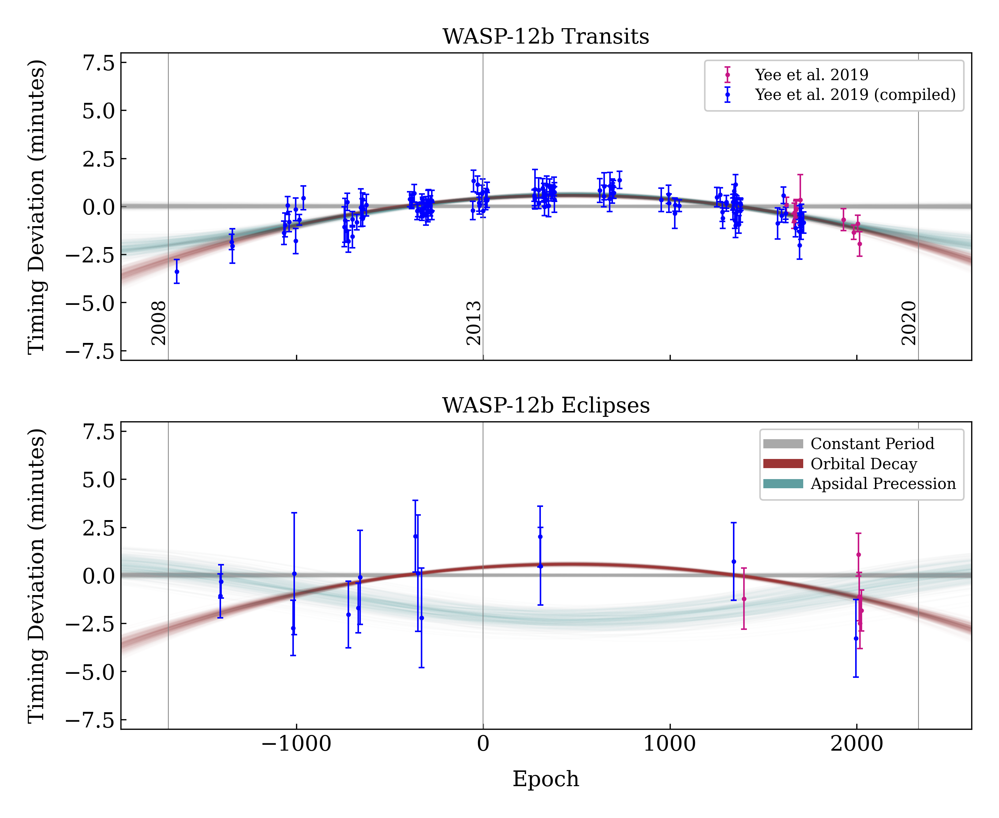

.. _example-wasp-12:

**************************
Orbital Decay of WASP-12 b
**************************
This example demonstrates an OrbDot reproduction of the results from *"The Orbit of WASP-12b Is Decaying"* by :cite:t:`Yee2020`, in which the authors performed a comprehensive analysis of new and published transit and eclipse mid-times for the Hot Jupiter WASP-12 b. They conclude that the orbit is decaying at a rate of :math:`-29.0 \pm 2.0 \, \mathrm{ms \, yr^{-1}}`, which corresponds to a remaining lifetime of :math:`3.25 \, \mathrm{Myr}` and a modified stellar tidal quality factor of :math:`1.75 \times 10^5`.

Using the authors' compiled table of transit and eclipse mid-times, we will fit the constant-period, orbital decay, and apsidal precession models to the data, compare the Bayesian evidences, and use OrbDot's :class:`~orbdot.analysis.Analyzer` class to reproduce the derived results.

.. tip::
    The files needed to run the OrbDot examples are stored in the `examples/ directory <https://github.com/simonehagey/orbdot/tree/main/examples>`_ and can be downloaded directly by clicking :download:`this link <_downloads/examples.zip>`. The full script for this example is saved in the file ``examples/example_wasp-12.py`` and can be run without modifications.

------------

Setup
=====
Before running the model fits, we need to save the transit and eclipse mid-times to a :ref:`data file <data-files>`, populate the star-planet :ref:`info file <info-file>`, and create a :ref:`settings file <settings-file>`.

Data
----
The transit mid-times are taken from Table 5 of :cite:author:`Yee2020` and saved in the file: ``examples/data/WASP-12_mid_times.txt``.

.. important::
    Note that the eclipse mid-times, listed at the end of the file, are specified by a half-orbit (0.5) in the ``Epoch`` column, which is required for OrbDot to treat them separately from the transit mid-times.

The authors clarify that the eclipse mid-times provided in the table have not been corrected for the light-travel time across the extent of the orbit, so we have accounted for that by subtracting :math:`2a/c = 22.9 \, \mathrm{s}`. Additionally, to simplify the appearance of the plots, the ``Source`` column has been modified to reflect only whether the measurement was compiled by the authors (``"Yee et al. 2019 (compiled)"``) or if it is a new observation that they provide (``"Yee et al. 2019"``).

.. admonition:: Partial table of WASP-12 b mid-times
  :class: dropdown

  .. code-block:: text

    Epoch BJD Err Source
    -1640 2454515.52496 0.00043 "Yee et al. 2019 (compiled)"
    -1346 2454836.40340 0.00028 "Yee et al. 2019 (compiled)"
    -1342 2454840.76893 0.00062 "Yee et al. 2019 (compiled)"

    ...

    2014.5 2458504.1196137965 0.00087 "Yee et al. 2019"
    2018.5 2458508.4843237964 0.00091 "Yee et al. 2019"
    2026.5 2458517.2161437960 0.00074 "Yee et al. 2019"

System Info File
----------------
The WASP-12 :ref:`system info file <info-file>` is saved as: ``examples/info_files/WASP-12_info.json``. The star and planet masses, stellar radius, and orbit ephemeris are the same as the values adopted in :cite:author:`Yee2020`, but the unit of the planet's mass has been converted from Jupiter masses to Earth masses to adhere to the OrbDot convention. The sky coordinates and discovery year are not necessary for the analysis, but are useful for additional context.

.. admonition:: WASP-12 system information file
  :class: dropdown

    .. code-block:: JSON

        {
          "_comment1": "WASP-12 System Info",

              "star_name": "WASP-12",
              "RA": "06h30m32.79s",
              "DEC": "+29d40m20.16s",
              "discovery_year": 2008,

          "_comment2": "Star Properties",

              "M_s [M_sun]": 1.38,
              "R_s [R_sun]": 1.62,

          "_comment3": "Planet Properties",

              "planets": ["b"],
              "M_p [M_earth]": [467.3223],

          "_comment4": "Model Parameters",

            "__comment4": "Orbital Elements",

               "_comment4_1": "Orbital Elements",
               "t0 [BJD_TDB]": [2456305.455522],
               "P [days]": [1.09141953],
               "e": [0.0],
               "w [rad]": [0.0],

               "__comment4_2": "Time-Dependant",
               "PdE [days/E]": [0.0],
               "wdE [rad/E]": [0.0]
        }

Settings File
-------------
The :ref:`settings file <settings-file>` is saved as: ``examples/settings_files/WASP-12_settings.json``. We have also provided a custom plot settings file (``examples/settings_files/WASP-12_plot_settings.json``), but this is not a requirement.

.. admonition:: WASP-12 b settings file
  :class: dropdown

    .. code-block:: JSON

        {"_comment0": "WASP-12 b Settings",

          "_comment1": "Input Files",

              "main_save_dir": "results/",
              "system_info_file": "info_files/WASP-12_info.json",
              "plot_settings_file": "settings_files/WASP-12_plot_settings.json",

          "_comment2": "Model Fits",

               "TTV_fit": {
                 "save_dir": "ttv_fits/",
                 "data_file": "data/WASP-12b_mid_times.txt",
                 "data_delimiter": " ",
                 "sampler": "nestle",
                 "n_live_points": 1000,
                 "evidence_tolerance": 0.01
               },

          "_comment3": "Priors",

               "prior": {

                 "t0": ["gaussian", 2456305.4555, 0.01],
                 "P0": ["gaussian", 1.09142, 0.0001],
                 "e0": ["uniform", 0.0, 0.1],
                 "w0": ["uniform", 0.0, 6.2831853072],
                 "PdE": ["uniform", -1e-7, 0],
                 "wdE": ["uniform", 0.0, 0.01]
               }
        }

.. admonition:: Plot settings file
  :class: dropdown

  .. code-block:: JSON

        {"_comment1": "TTV (O-C) plot settings",

          "TTV_PLOT": {
                "num_epochs_pre_data": 300,
                "num_epochs_post_data": 600,
                "y_axis_limits": [-8, 8],
                "reference_dates": ["2008-01-01", "2020-01-01"],
                "data_colors": ["mediumvioletred", "blue"]
          }
        }

The first part of the settings file specifies path names for the other input files with the ``"system_info_file"`` and ``"plot_settings_file"`` keys, and the base directory for saving the results with the ``"main_save_dir"`` key.

.. code-block:: JSON

    {"_comment0": "WASP-12 b Settings",

      "_comment1": "Input Files",

          "main_save_dir": "results/",
          "system_info_file": "info_files/WASP-12_info.json",
          "plot_settings_file": "settings_files/WASP-12_plot_settings.json",
    ...

The next section(s) of the file are specific to the model fitting. Because we are only fitting transit and eclipse mid-times in this example, we only need to provide an entry for the ``"TTV_fit"`` key. The value for ``"TTV_fit"`` is a dictionary that points to and describes the data file (``"data_file"`` and ``"data_delimiter"``), provides a sub-directory for saving the TTV model fit results (``"save_dir"``), and specifies the desired sampling package (``"sampler"``), number of live points (``"n_live_points"``) and evidence tolerance (``"evidence_tolerance"``).

In this case, the ``"nestle"`` sampler has been specified with 1000 live points and an evidence tolerance of 0.01, which should balance well-converged results with a short run-time.

.. code-block:: JSON

    ...

        "_comment2": "Model Fits",

           "TTV_fit": {
             "save_dir": "ttv_fits/",
             "data_file": "data/WASP-12b_mid_times.txt",
             "data_delimiter": " ",
             "sampler": "nestle",
             "n_live_points": 1000,
             "evidence_tolerance": 0.01
           },
    ...

The remaining portion of the settings file is for the ``"prior"`` dictionary, which defines the :ref:`prior distributions <priors>` for the model parameters. We need only populate this with the parameters that are to be included in the model fits, which in this case are the reference transit mid-time ``"t0"``, orbital period ``"P0"``, eccentricity ``"e0"``, argument of pericentre ``"w0"``, orbital decay rate ``"PdE"``, and apsidal precession rate ``"wdE"``. If a model parameter is left out of the settings file, the default prior will be used, as specified in the file ``orbdot/defaults/default_info_file.json``. For more information on the available model parameters see :ref:`model_parameters`.

For WASP-12 b, we have chosen broad uniform prior distributions for ``"e0"``, ``"w0"``, ``"PdE"``, and ``"wdE"``, and Gaussian distributions for ``"t0"`` and ``"P0"`` that are centered on the known orbit. In the case of Gaussian priors, the first value represents the mean and the second the standard deviation. For uniform priors, the first and second values correspond to the minimum and maximum limits, respectively.

.. code-block:: JSON

    ...

        "_comment3": "Priors",

           "prior": {

             "t0": ["gaussian", 2456305.4555, 0.01],
             "P0": ["gaussian", 1.09142, 0.0001],
             "e0": ["uniform", 0.0, 0.1],
             "w0": ["uniform", 0.0, 6.2831853072],
             "PdE": ["uniform", -1e-7, 0],
             "wdE": ["uniform", 0.0, 0.01]
           }
    }

------------

Model Fits
==========
In the following sections we will fit the WASP-12 b mid-times to the constant-period, orbital decay, and apsidal precession models, and compare the results to those of :cite:author:`Yee2020` The first step is to import the :class:`~orbdot.star_planet.StarPlanet` and :class:`~orbdot.analysis.Analyzer` classes, and then to create an instance of :class:`~orbdot.star_planet.StarPlanet` that represents WASP-12 b:

.. code-block:: python

    from orbdot.star_planet import StarPlanet
    from orbdot.analysis import Analyzer

    # initialize the StarPlanet class
    wasp12 = StarPlanet('settings_files/WASP-12_settings.json')

To run the model fitting routines, the :meth:`~orbdot.transit_timing.TransitTiming.run_ttv_fit` method is called with the ``model`` argument given as ``"constant"``, ``"decay"``, or ``"precession"``. The free parameters are specified in a list of strings, for example: ``["t0", "P0", "PdE"]`` for orbital decay.

Constant-Period Model Fit
-------------------------
The following code snippet fits a constant-period, circular orbit model to the mid-times:

.. code-block:: python

    # run the constant-period TTV model fit
    fit_c = wasp12.run_ttv_fit(['t0', 'P0'], model='constant')

Once the fit is complete, the output files can be found in the directory that was given in the settings file, in this case: ``examples/results/WASP-12/ttv_fits/``. The ``ttv_constant_summary.txt`` file, shown in the dropdown menu below, is a convenient text summary of the model fit.

.. admonition:: Summary of the constant-period model fit:
  :class: dropdown

    .. code-block:: text

        Stats
        -----
        Sampler: nestle
        Free parameters: ['t0' 'P0']
        log(Z) = -204.56 ± 0.11
        Run time (s): 3.58
        Num live points: 1000
        Evidence tolerance: 0.01
        Eff. samples per second: 1104

        Results
        -------
        t0 = 2456305.4555211244 + 2.541998401284218e-05 - 2.416549250483513e-05
        P0 = 1.091419640127365 + 2.7275076863730874e-08 - 2.6061967250967655e-08

        Fixed Parameters
        ----------------
        e0 = 0.0
        w0 = 0.0

This shows us that it took 3.58 seconds to run the model fit and that the Bayesian evidence (``log(Z)``) for the is -204.6. The best-fit parameter values are also shown, with the uncertainties derived from the 68% credible intervals. The following table compares these results with those of :cite:author:`Yee2020` and we see that they agree.

.. list-table::
   :header-rows: 1

   * - Parameter
     - Unit
     - Yee et al. (2020)
     - OrbDot
   * - :math:`t_0`
     - :math:`\mathrm{BJD}_\mathrm{TDB}`
     - :math:`2456305.455521 \,\pm\, 0.000026`
     - :math:`2456305.455521^{\,+0.000025}_{\,-0.000024}`
   * - :math:`P_0`
     - :math:`\mathrm{days}`
     - :math:`1.091419649 \,\pm\, 0.000000026`
     - :math:`1.091419640^{\,+0.000000027}_{\,-0.000000026}`

Orbital Decay Fit
-----------------
To fit the orbital decay timing model we use the same method, this time specifying ``model="decay"``:

.. code-block:: python

    # run the orbital decay TTV model fit
    fit_d = wasp12.run_ttv_fit(['t0', 'P0', 'PdE'], model='decay')

The ``ttv_decay_summary.txt`` file shows us that the fitting routine ran for 7.04 seconds and that the Bayesian evidence is -104.5. The evidence clearly demonstrates that orbital decay is a far better fit to the data than an unchanging orbit model, but we will quantify this later on.

.. admonition:: Summary of the orbital decay model fit:
  :class: dropdown

    .. code-block:: text

        Stats
        -----
        Sampler: nestle
        Free parameters: ['t0' 'P0' 'PdE']
        log(Z) = -104.47 ± 0.14
        Run time (s): 7.04
        Num live points: 1000
        Evidence tolerance: 0.01
        Eff. samples per second: 663

        Results
        -------
        t0 = 2456305.4558077552 + 3.379490226507187e-05 - 3.208918496966362e-05
        P0 = 1.0914201076440608 + 4.156631039364811e-08 - 4.3833844109997244e-08
        PdE = -1.00348670058712e-09 + 6.98096735732343e-11 - 6.878773061871802e-11
        dPdt (ms/yr) = -29.015070989305705 + 2.0184947476459363 - 1.9889460278124174

        Fixed Parameters
        ----------------
        e0 = 0.0
        w0 = 0.0

The following table compares the orbital decay fit with that of :cite:author:`Yee2020` and we again see that the OrbDot results are in excellent agreement!

.. list-table::
   :header-rows: 1

   * - Parameter
     - Unit
     - Yee et al. (2020)
     - OrbDot
   * - :math:`t_0`
     - :math:`\mathrm{BJD}_\mathrm{TDB}`
     - :math:`2456305.455809 \, \pm \, 0.000032`
     - :math:`2456305.455808^{\,+0.000034}_{\,-0.000032}`
   * - :math:`P_0`
     - :math:`\mathrm{days}`
     - :math:`1.091420107 \, \pm \, 0.000000042`
     - :math:`1.091420108^{\,+0.000000042}_{\,-0.000000044}`
   * - :math:`dP/dE`
     - :math:`\mathrm{days\,E}^{-1}`
     - :math:`−10.04 \times 10^{−10} \, \pm \, 0.69 \times 10^{−10}`
     - :math:`{-10.03 \times 10^{-10}}^{\,+0.70 \times 10^{-10}}_{\,-0.69 \times 10^{-10}}`
   * - :math:`dP/dt`
     - :math:`\mathrm{ms\,yr}^{-1}`
     - :math:`-29.0 \, \pm \, 2.0`
     - :math:`-29.0 \, \pm \, 2.0`

Apsidal Precession Fit
----------------------
Similarly, the apsidal precession model can be fitted by specifying ``model="precession"``:

.. code-block:: python

    # run the apsidal precession TTV model fit
    fit_p = wasp12.run_ttv_fit(['t0', 'P0', 'e0', 'w0', 'wdE'], model='precession')

This time the summary file (``ttv_precession_summary.txt``) shows us that the model fit took 43.82 seconds to run and that the Bayesian evidence is -116.3. We will compare this with the other models in the next section of this tutorial.

.. admonition:: Summary of the apsidal precession model fit:
  :class: dropdown

    .. code-block:: text

        Stats
        -----
        Sampler: nestle
        Free parameters: ['t0' 'P0' 'e0' 'w0' 'wdE']
        log(Z) = -116.27 ± 0.15
        Run time (s): 43.82
        Num live points: 1000
        Evidence tolerance: 0.01
        Eff. samples per second: 135

        Results
        -------
        t0 = 2456305.454880826 + 0.00011899974197149277 - 0.00011747609823942184
        P0 = 1.09141962928784 + 8.208843849111247e-08 - 8.127643225108727e-08
        e0 = 0.003102454871620994 + 0.00035413532779573955 - 0.000348981821072355
        w0 = 2.6150255828399716 + 0.09729062315255002 - 0.09844838245938625
        wdE = 0.0010728800848238081 + 7.821040607610633e-05 - 6.420401515008301e-05

        Fixed Parameters
        ----------------

The table below shows again that the OrbDot result agrees with :cite:author:`Yee2020`

.. list-table::
   :header-rows: 1

   * - Parameter
     - Unit
     - Yee et al. (2020)
     - OrbDot
   * - :math:`t_0`
     - :math:`\mathrm{BJD}_\mathrm{TDB}`
     - :math:`2456305.45488 \, \pm \, 0.00012`
     - :math:`2456305.45488^{\,+0.00012}_{\,-0.00012}`
   * - :math:`P_0`
     - :math:`\mathrm{days}`
     - :math:`1.091419633 \, \pm \, 0.000000081`
     - :math:`1.09141962928784^{\,+0.000000082}_{\,-0.000000081}`
   * - :math:`e_0`
     - --
     - :math:`0.00310 \, \pm \, 0.00035`
     - :math:`0.00310^{\,+0.00035}_{\,-0.00035}`
   * - :math:`w_0`
     - :math:`\mathrm{rad}`
     - :math:`2.62 \, \pm \, 0.10`
     - :math:`2.62^{\,+0.10}_{\,-0.10}`
   * - :math:`d\omega/dE`
     - :math:`\mathrm{rad \, E}^{-1}`
     - :math:`0.000984^{\,+0.000070}_{\,-0.000061}`
     - :math:`0.001073^{\,+0.000078}_{\,-0.000064}`

The following plot displays the timing residuals of WASP-12 b with future projections of all three models, shown with 300 random draws from the weighted posterior samples. Each data point is the difference between the observed time and the time predicted by the best-fit constant-period model. OrbDot automatically detects the previous model fits by matching the ``file_suffix`` argument of :meth:`~orbdot.transit_timing.TransitTiming.run_ttv_fit`, which we left blank for this example.

------------

Interpreting the Results
========================
Now that the model fitting is complete, we will use the :class:`~orbdot.analysis.Analyzer` class to help interpret the results. Creating an instance of the :class:`~orbdot.analysis.Analyzer` class requires a :class:`~orbdot.star_planet.StarPlanet` object (ie. ``wasp12``) and the results of a model fit. It is for this reason that we had assigned the output of the model fits to the variables ``fit_c``, ``fit_d``, and ``fit_p``, above.

The following code snippet creates an ``Analyzer`` object with the results of the orbital decay fit:

.. code-block:: python

    # create an 'Analyzer' instance for the orbital decay results
    analyzer = Analyzer(wasp12, fit_d)

We can now call relevant :class:`~orbdot.analysis.Analyzer` methods, the result of which will appear in the file: ``analysis/ttv_decay_analysis.txt``.

Model Comparison
----------------
Calling the :meth:`~orbdot.analysis.Analyzer.model_comparison` method compares the orbital decay fit to another by calculating the Bayes factor and evaluating the strength of the evidence with thresholds given by :cite:author:`KassRaftery1995`. The following code snippet calls this method twice, once for the constant-period model fit (``fit_c``), and once for the apsidal precession model fit (``fit_p``):

.. code-block:: python

    # compare the Bayesian evidence for the orbital decay and constant-period models
    analyzer.model_comparison(fit_c)

    # compare the Bayesian evidence for the orbital decay and apsidal precession models
    analyzer.model_comparison(fit_p)

Now the analysis file looks like this:

.. code-block:: text

    WASP-12b Analysis | model: 'ttv_decay'

    Model Comparison
    ---------------------------------------------------------------------------
     * Very strong evidence for Model 1 vs. Model 2  (B = 2.93e+43)
          Model 1: 'ttv_decay', logZ = -104.47
          Model 2: 'ttv_constant', logZ = -204.56

    Model Comparison
    ---------------------------------------------------------------------------
     * Very strong evidence for Model 1 vs. Model 2  (B = 1.33e+05)
          Model 1: 'ttv_decay', logZ = -104.47
          Model 2: 'ttv_precession', logZ = -116.27

confirming that the evidence for the orbital decay model is very strong.

Orbital Decay Analysis
----------------------
The final step of this example is to call the :meth:`~orbdot.analysis.Analyzer.orbital_decay_fit` method, which enables further interpretation of the orbital decay model fit:

.. code-block:: python

    # interpret the best-fit orbital decay model
    analyzer.orbital_decay_fit()

This appends the following summary to the ``analysis/ttv_decay_analysis.txt`` file:

.. code-block:: text

    Orbital Decay Model Fit
    ---------------------------------------------------------------------------
     * Best-fit orbital decay rate:
          dP/dE = -1.00E-09 + 6.98E-11 - 6.88E-11 days/E
          dP/dt = -29.02 + 2.02 - 1.99 ms/yr
     * Modified stellar quality factor:
          Q' = 3.46E+05
     * Remaining lifetime:
          tau = 3.25E+00 Myr
     * Energy loss rate:
          dEdt = -4.81E+23 W
     * Angular momentum loss rate:
          dLdt = -7.22E+27 kg m^2 / s^2

We see that the best-fit orbital decay model yields a stellar tidal quality factor of :math:`3.46 \times 10^5`, a remaining lifetime of :math:`3.25 \, \mathrm{Myr}`, and a decrease in orbital energy and angular momentum equal to :math:`-4.8 \times 10^{23} \, \mathrm{W}` and :math:`-7.2 \times 10^{27} \, \mathrm{kg \, m^2 \, s^{-2}}`, respectively. The following table shows that all of these derived results agree with :cite:author:`Yee2020`

.. list-table::
   :header-rows: 1

   * - Parameter
     - Unit
     - Yee et al. (2020)
     - OrbDot
   * - :math:`Q'_*`
     - --
     - :math:`1.75 \times 10^5`
     - :math:`3.46 \times 10^5` (see note below)
   * - :math:`\tau`
     - :math:`\mathrm{Myr}`
     - :math:`3.25`
     - :math:`3.25`
   * - :math:`dE/dt`
     - :math:`W`
     - :math:`-5 \times 10^{23}`
     - :math:`-4.8 \times 10^{23}`
   * - :math:`dL/dt`
     - :math:`\mathrm{kg \, m^2 \, s^{-2}}`
     - :math:`-7 \times 10^{27}`
     - :math:`-7.2 \times 10^{27}`

.. note::
    The value of :math:`Q'_*` from OrbDot is twice the value from :cite:t:`Yee2020` (:math:`3.46 \times 10^5 / 2 = 1.73 \times 10^5`). This is because the tidal evolution models used in OrbDot are derived from the "constant time lag" approach to equilibrium tidal theory, whereas the :cite:t:`Yee2020` study adopts an equation for :math:`Q'_*` that is derived from the “constant phase lag” approach of :cite:t:`Goldreich1966`. The former approach does not rely on the assumption that the star-planet system is coplanar, allowing for applications to a wider variety of star-planet system architectures. See :cite:t:`Correia2010` for a thorough description and comparison of these models.

------------

Conclusion
==========
In this example, we have learned how to use OrbDot for fitting transit and eclipse timing models by analyzing the WASP-12 b mid-times provided in *"The Orbit of WASP-12b is Decaying"* by :cite:t:`Yee2020`. The full script for this example is saved in the file ``examples/example_wasp12.py`` and can be run without modifications. We have seen that the results of the OrbDot model fitting are in excellent agreement with the results of :cite:t:`Yee2020`, which they provide in Table 6 of the paper.