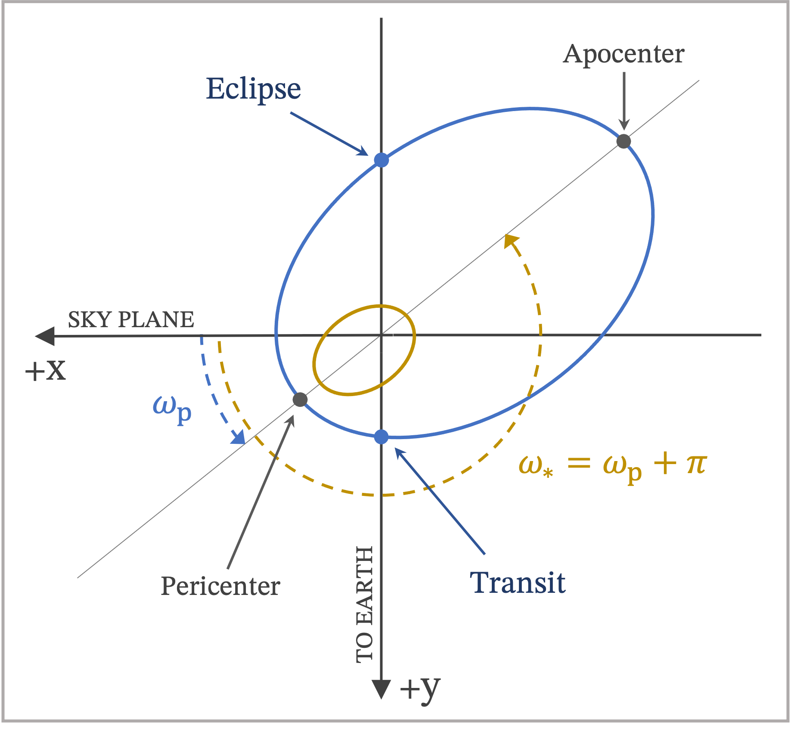

.. _models:

******
Theory
******

.. _model_parameters:

Model Parameters
================
It is important for the user to be familiar with the symbols and definitions of the OrbDot parameter set, described in the table below. Some of these parameters are not currently implemented in the OrbDot models, but are planned for future integration. These are indicated with a footnote [*].

**Orbital Elements**

 .. list-table::
   :header-rows: 1
   :widths: 30 25 25 100

   * - Parameter
     - Symbol
     - Unit
     - Description
   * - :math:`t_0`
     - ``t0``
     - :math:`\mathrm{BJD}_\mathrm{TDB}`
     - The reference transit mid-time.
   * - :math:`P_0`
     - ``P0``
     - :math:`\mathrm{days}`
     - The observed (sidereal) orbital period.
   * - :math:`e_0`
     - ``e0``
     -
     - The eccentricity of the orbit.
   * - :math:`\omega_0`
     - ``w0``
     - :math:`\mathrm{rad}`
     - The argument of pericenter of the planet's orbit.
   * - :math:`i_0`
     - ``i0``
     - :math:`\mathrm{deg}`
     - The line-of-sight inclination of the orbit.
   * - :math:`\Omega_0`
     - ``O0``
     - :math:`\mathrm{rad}`
     - The longitude of the ascending node. [*]_

**Coupled Parameters**

 .. list-table::
   :header-rows: 1
   :widths: 30 25 20 100

   * - Parameter
     - Symbol
     - Unit
     - Description
   * - :math:`e_0\,\cos{\omega_0}`
     - ``ecosw``
     -
     - The eccentricity :math:`e_0` multiplied by the cosine of :math:`\omega_0`.
   * - :math:`e_0\,\sin{\omega_0}`
     - ``esinw``
     -
     - the eccentricity :math:`e_0` multiplied by the sine of :math:`\omega_0`.
   * - :math:`\sqrt{e_0}\,\cos{\omega_0}`
     - ``sq_ecosw``
     -
     - The square root of :math:`e_0` multiplied by the cosine of :math:`\omega_0`.
   * - :math:`\sqrt{e_0}\,\sin{\omega_0}`
     - ``sq_esinw``
     -
     - The square root of :math:`e_0` multiplied by the sine of :math:`\omega_0`.

**Time-Dependent Parameters**

 .. list-table::
    :header-rows: 1
    :widths: 25 15 25 100

    * - Parameter
      - Symbol
      - Unit
      - Description
    * - :math:`\frac{dP}{dE}`
      - ``PdE``
      - :math:`\mathrm{days}` :math:`E^{-1}`
      - A constant change of the orbital period.
    * - :math:`\frac{d \omega}{dE}`
      - ``wdE``
      - :math:`\mathrm{rad}` :math:`E^{-1}`
      - A constant change of the argument of pericenter.
    * - :math:`\frac{de}{dE}`
      - ``edE``
      - :math:`E^{-1}`
      - A constant change of the orbital eccentricity. [*]_
    * - :math:`\frac{di}{dE}`
      - ``idE``
      - :math:`\mathrm{deg}` :math:`E^{-1}`
      - A constant change of the line-of-sight inclination. [*]_
    * - :math:`\frac{d \Omega}{dE}`
      - ``OdE``
      - :math:`\mathrm{rad}` :math:`E^{-1}`
      - A constant change of the long. of the ascending node. [*]_

**Radial Velocity Parameters**

 .. list-table::
   :header-rows: 2
   :widths: 20 15 25 70

   * - Parameter
     - Symbol
     - Unit
     - Description
   * - :math:`K`
     - ``K``
     - m :math:`{\mathrm s}^{-1}`
     - The radial velocity semi-amplitude.
   * - :math:`\gamma_j`
     - ``v0``
     - :math:`\mathrm{m}` :math:`{\mathrm s}^{-1}`
     - An instrument specific systemic radial velocity.
   * - :math:`\sigma_j`
     - ``jit``
     - :math:`\mathrm{m}` :math:`{\mathrm s}^{-1}`
     - An instrument-specific radial velocity "jitter" term.
   * - :math:`\dot{\gamma}`
     - ``dvdt``
     - :math:`\mathrm{m}` :math:`{\mathrm s}^{-1}` :math:`{\mathrm day}^{-1}`
     - A linear radial velocity trend.
   * - :math:`\ddot{\gamma}`
     - ``ddvdt``
     - :math:`\mathrm{m}` :math:`{\mathrm s}^{-1}` :math:`{\mathrm day}^{-2}`
     - A second order radial velocity trend.
   * - :math:`K_{\mathrm{tide}}`
     - ``K_tide``
     - :math:`\mathrm{m}` :math:`{\mathrm s}^{-1}`
     - The amplitude of a tidal radial velocity signal from the star. [*]_

.. [*] Not currently implemented in the OrbDot models.

------------

.. _coordinate_system:

Coordinate System
=================
The OrbDot models are written in a coordinate system in which the sky plane lies on the x-z plane and the y-axis points toward the observer along the line of sight.

It is critical to be consistent in the definition of the argument of pericenter :math:`\omega` when simultaneously fitting transit and eclipse mid-times and radial velocities. In the OrbDot coordinate system, the argument of pericenter is determined from the positive x-axis, such that a transit occurs when the true anomaly :math:`\phi` is equal to:

.. math::
    \phi_{\mathrm{I}}\,=\,\frac{\pi}{2} - \omega_p

and an eclipse occurs when:

.. math::
    \phi_{\mathrm{II}} = \frac{3\pi}{2} - \omega_p

where :math:`\omega_p` is the argument of pericenter of the planetary orbit.

------------

Transit and Eclipse Timing Models
=================================
OrbDot currently supports model fitting for three transit and/or eclipse timing models:

 1. An unchanging orbit that is circular or eccentric ("constant-period").
 2. A constant evolution of the orbital period, :math:`\dot{P}` ("orbital decay").
 3. A constant evolution of the argument of pericenter, :math:`\dot{\omega}` ("apsidal precession").

Constant-Period
---------------
For a planet on a circular, unchanging orbit, we expect a linear increase in the center times of both transits :math:`t_{\mathrm{I}}` and eclipses :math:`t_{\mathrm{II}}`, modeled as:

.. math:: t_{\mathrm{I}} = t_0 + PE

.. math:: t_{\mathrm{II}} = t_0 + PE + \frac{P}{2}

where :math:`t_0` is the reference transit time, :math:`P` is the orbital period, and :math:`E` is the epoch, which represents the number of orbits that have passed since time :math:`t_0`.

If the orbit is eccentric, we must add an offset to the eclipse times to account for the variable speed of the planet:

.. math:: t_{\mathrm{I}} = t_0 + PE
.. math:: t_{\mathrm{II}} = t_0 + PE + \frac{P}{2} + \frac{Pe}{\pi}\,\cos{\omega_p}

where :math:`\omega_p` is the argument of pericenter of the planetary orbit and :math:`e` is the eccentricity.

The ``orbdot.models.ttv_models.ttv_constant()`` method implements this model:

.. autofunction:: orbdot.models.ttv_models.ttv_constant

Orbital Decay
-------------
For a planet on a decaying circular orbit with a constant rate of orbital period change, the mid-times of the transits :math:`t_{\mathrm{I}}` and eclipses :math:`t_{\mathrm{II}}` are modeled as:

.. math:: t_{\mathrm{I}} = t_0 + PE + \frac{1}{2}\,\frac{dP}{dE}\,E^2
.. math:: t_{\mathrm{II}} = t_0 + PE + \frac{P}{2} + \frac{1}{2}\,\frac{dP}{dE}\,E^2

where :math:`t_0` is the reference transit time, :math:`P` is the orbital period, :math:`dP/dE` is the rate of change of the period in units of days per epoch, and :math:`E` is the epoch. Though the main application of this model is for orbital decay, a positive period derivative is allowed.

The ``orbdot.models.ttv_models.ttv_decay()`` method implements this model:

.. autofunction:: orbdot.models.ttv_models.ttv_decay

Apsidal Precession
------------------
For a planet on an elliptical orbit undergoing apsidal precession, the mid-times of the transits :math:`t_{\mathrm{I}}` and eclipses :math:`t_{\mathrm{II}}` are modeled as :cite:p:`Gimenez1995, Patra2017`:

.. math:: t_{\mathrm{I}} = t_0 + P_s E - \frac{e P_a}{\pi}\cos{\omega_p}
.. math:: t_{\mathrm{II}} = t_0 + P_s E + \frac{P_a}{2} + \frac{eP_a}{\pi}\cos{\omega_p}

where :math:`t_0` is the reference transit time, :math:`e` is the orbit eccentricity, :math:`\omega_p` is the argument of pericenter, and :math:`E` is the epoch. We assume that :math:`\omega_p` evolves at a constant rate, denoted as :math:`d\omega/dE`, such that at any given epoch :math:`\omega_p` is given by:

.. math::
    \omega_{p}\left(E\right) = \omega_0 + \frac{d\omega}{dE}\,E

where :math:`\omega_0` is the value of :math:`\omega_p` at time :math:`t_0`.

In the equations above, :math:`P_a` represents the anomalistic orbital period, i.e., the elapsed time between subsequent pericenter passages, which characterizes the osculating orbit. :math:`P_s` is the sidereal period, representing the observed orbital period of the system, and is related to the anomalistic period by:

.. math::
    P_s = P_a\left(1-\frac{d\omega/{dE}}{2\pi}\right)

The ``orbdot.models.ttv_models.ttv_precession`` method implements this model:

.. autofunction:: orbdot.models.ttv_models.ttv_precession

------------

Radial Velocity Models
======================
OrbDot currently supports model fitting for three radial velocity models:

 1. An unchanging orbit that is circular or eccentric ("constant-period").
 2. A constant evolution of the orbital period, :math:`\dot{P}` ("orbital decay").
 3. A constant evolution of the argument of pericenter, :math:`\dot{\omega}` ("apsidal precession").

Background
----------
Many exoplanet host stars exhibit noticeable periodic radial velocity (RV) variations as they "wobble" around the center of mass of the star-planet system. The amplitude of this effect can be expressed as [1]_:

.. math::
    K=\left(\frac{2 \pi G}{P}\right)^{1/3}\frac{M_p \sin i}{\left(M_{\star}+M_p\right)^{2/3}}
    \frac{1}{\left(1-e^2\right)^{1/2}}

where :math:`M_p` is the planet mass, :math:`M_{\star}` is the star mass, :math:`i` is the line-of-sight inclination of the orbit, and :math:`G` is the universal gravitational constant.

At any given time, the periodic signal depends on the planet's position in its orbit, defined by the true anomaly :math:`\phi`, and the systemic velocity along the line-of-sight, denoted as :math:`\gamma`. When RV observations from multiple instruments are combined, it is standard practice to fit :math:`\gamma` individually for each source to account for instrumental variations. Additionally, we consider first and second-order acceleration terms, :math:`\dot{\gamma}` and :math:`\ddot{\gamma}` respectively, to accommodate potential perturbations from an outer, non-resonant companion planet with an orbital period longer than the observational baseline. The total observed radial velocity signal is:

.. math::
    v_r = K[\cos{(\phi\left(t\right)+\omega_p)}+e\cos{\omega_p}] + \gamma_j
    + \dot{\gamma} \left(t-t_0\right) + \frac{1}{2} \ddot{\gamma}\left(t-t_0\right)^2

where :math:`\omega_\star` is the argument of pericenter of the star's orbit, defined as :math:`\omega_\star = \omega_p + \pi`, and :math:`t_0` is a transit mid-time. OrbDot requires the reference time to that of a transit so that the phase at any time :math:`t` can be determined by the knowledge that when :math:`t=t_0` the true anomaly is :math:`\phi_0 = \frac{\pi}{2} - \omega_p`.

To avoid underestimating the parameters uncertainties, OrbDot implements an instrument-specific "jitter" parameter to represent systematic noise. When ``jit`` is given as a free parameter, it is added in quadrature with the individual measurement errors:

.. math::
    \sigma = \sqrt{\sigma_i^2 + \sigma_{jit}^2}

where :math:`\sigma_i` is the individual measurement error and :math:`\sigma_{jit}` is the instrument-dependent jitter term.

Constant-Period
---------------
The ``orbdot.models.rv_models.rv_constant()`` method implements the constant-period radial velocity model:

.. autofunction::
    orbdot.models.rv_models.rv_constant

Orbital Decay
-------------
The ``orbdot.models.rv_models.rv_decay()`` method implements the orbital decay radial velocity model:

.. autofunction::
    orbdot.models.rv_models.rv_decay

Apsidal Precession
------------------
The ``orbdot.models.rv_models.rv_precession()`` method implements the apsidal precession radial velocity model:

.. autofunction::
    orbdot.models.rv_models.rv_precession

------------

Transit Duration Models
=======================
.. attention::

    The transit duration fitting features of OrbDot have not been thoroughly tested and validated at this time. The methods are available to use, but the results should be treated with caution until this notice is removed.

OrbDot currently supports model fitting for three transit duration models:

 1. An unchanging orbit that is circular or eccentric ("constant-period").
 2. A constant evolution of the orbital period, :math:`\dot{P}` ("orbital decay").
 3. A constant evolution of the argument of pericenter, :math:`\dot{\omega}` ("apsidal precession").

Constant-Period
---------------
In general, the transit duration :math:`T` is calculated using equation (15) from :cite:t:`Kipping2010`:

.. math::
    T = \frac{P}{\pi} \frac{\varrho_c^2}{\sqrt{1-e^2}}
    \arcsin \left(\frac{\sqrt{1-a_R^2 \varrho_c^2 \cos ^2 i}}{a_R \varrho_c \sin i}\right)

where :math:`P` is the orbital period, :math:`e` is the orbit eccentricity, :math:`i` is the line-of-sight inclination of the orbit, :math:`a_R` is the semi major axis in units of stellar radii, :math:`\varrho_c` is the star-planet separation at mid-transit, and :math:`c` is the speed of light in a vacuum.

The ``orbdot.models.tdv_models.tdv_constant()`` method implements the constant-period transit duration model:

.. autofunction::
    orbdot.models.tdv_models.tdv_constant

Orbital Decay
-------------
For a planet on a decaying orbit, the change in transit duration over time can be modeled. As the orbit decays, the semi major axis decreases, leading to changes in the transit duration. This relationship is captured by equation (58) from :cite:t:`Kipping2010`:

.. math::
    \frac{dT}{da} = \frac{P}{\pi} \frac{\varrho_c^2}{a\sqrt{1-e^2}}\left(\frac{3}{2}
    \arcsin \left(\frac{\sqrt{1-b^2}}{a_R \varrho_{\mathrm{c}} \sin i}\right)\right)
    \left(\frac{1}{\sqrt{1-b^2}\sqrt{a_R^2\varrho_c^2-1}}\right)

where :math:`\frac{dT}{da}` is the change in the transit duration with changing semi-major axis and :math:`b` is the impact parameter. In this case, the change in the transit duration per epoch may be expressed as:

.. math::
    \frac{dT}{dE} = \frac{dT}{da}\frac{da}{dP}\frac{dP}{dE}

such that the transit duration as a function of epoch :math:`E` is:

.. math::
    T(E) = T_0 + \frac{dT}{dE}\,E

The ``orbdot.models.tdv_models.tdv_decay()`` method implements the orbital decay transit duration model:

.. autofunction::
    orbdot.models.tdv_models.tdv_decay

Apsidal Precession
------------------
For a planet on an elliptical orbit undergoing apsidal precession, the change in the argument of pericenter :math:`\omega_p` affects the transit duration. This relationship is captured by equation (54) from :cite:t:`Kipping2010`:

.. math::
    \frac{dT}{d \omega} =  \frac{P}{\pi} \frac{e \varrho_{\mathrm{c}}^3 \cos\omega}{\left(1-e^2\right)^{3 / 2}}
    \left(\frac{1}{\sqrt{1-b^2} \sqrt{a_R^2 \varrho_c^2-1}}\right) \left (-2 \arcsin \left(\frac{\sqrt{1-b^2}}
    {a_R \varrho_c \sin i}\right)\right)

where :math:`\frac{dT}{d \omega}` is the change in the transit duration with changing argument of pericenter and :math:`b` is the impact parameter. The change in the transit duration per epoch may be expressed as:

.. math::
    \frac{dT}{dE} = \frac{dT}{d\omega}\frac{d\omega}{dE}

such that the transit duration as a function of epoch :math:`E` is:

.. math::
    T(E) = T_0 + \frac{dT}{dE}\,E

The ``orbdot.models.tdv_models.tdv_precession()`` method implements the apsidal precession transit duration model:

.. autofunction::
    orbdot.models.tdv_models.tdv_precession

------------

.. _theory_module:

The ``theory`` Module
=====================
The :py:mod:`~orbdot.models.theory` module provides several analytical models for investigating long-term variations in planetary orbits and their causes. Some of these models are used in the :class:`~orbdot.analysis.Analyzer` class (see :ref:`interpreting-results`). The key methods of this class are listed below, organized by subject.

.. _orbital_decay_theory:

Equilibrium Tides
-----------------
Due to the close proximity of Hot Jupiters (HJs) to their host stars, significant tidal bulges—an ellipsoidal distortion—are raised in both the planet and the star. In the case of orbital decay, the planet's orbital rate is faster than the star's rotational rate. As a result, the star's tidal bulge lags behind the HJ, creating a net torque that spins up the star at the expense of the planet's orbital angular momentum :cite:p:`levrard2009, Matsumura2010`. The tidal forces raised by the misaligned tidal bulges are known as "equilibrium tides" and are believed to be the most significant process governing the future evolution of HJ orbits :cite:p:`Ma2021, Barker2020`.

The following OrbDot functions are relevant to these effects:

.. autofunction:: orbdot.models.theory.decay_pdot_from_quality_factor
.. autofunction:: orbdot.models.theory.decay_quality_factor_from_pdot
.. autofunction:: orbdot.models.theory.decay_empirical_quality_factor
.. autofunction:: orbdot.models.theory.decay_timescale
.. autofunction:: orbdot.models.theory.decay_energy_loss
.. autofunction:: orbdot.models.theory.decay_angular_momentum_loss

------------

.. _apsidal_precession_theory:

Apsidal Precession
------------------
Apsidal precession is the gradual increase of the argument of pericenter of a planet's orbit :math:`\omega_p` over time, meaning the line connecting the pericenter and apocenter of the orbit rotates through :math:`2\pi` in one precession period. This can result from several factors, including general relativistic effects, perturbations from other planets, and gravitational moments arising from both the host star's rotation and planetary tidal bulges.

The following OrbDot functions are relevant to these effects:

General Relativity
^^^^^^^^^^^^^^^^^^
.. autofunction:: orbdot.models.theory.precession_gr

Rotation
^^^^^^^^
.. autofunction:: orbdot.models.theory.precession_rotational_planet
.. autofunction:: orbdot.models.theory.precession_rotational_planet_k2
.. autofunction:: orbdot.models.theory.precession_rotational_star
.. autofunction:: orbdot.models.theory.precession_rotational_star_k2

Tides
^^^^^
.. autofunction:: orbdot.models.theory.precession_tidal_planet
.. autofunction:: orbdot.models.theory.precession_tidal_planet_k2
.. autofunction:: orbdot.models.theory.precession_tidal_star
.. autofunction:: orbdot.models.theory.precession_tidal_star_k2

Transit Variations
^^^^^^^^^^^^^^^^^^
.. autofunction:: orbdot.models.theory.get_pdot_from_wdot
.. autofunction:: orbdot.models.theory.get_tdot_from_wdot

------------

.. _proper_motion_theory:

Proper Motion
-------------
Proper motion is the movement of a star through space with respect to the reference frame of the Solar System. This motion is partially constrained with measurements of the proper motion on the sky-plane, :math:`\mu`, and the radial velocity, :math:`v_r`. The proper motion of an exoplanet host star changes the orientation of the orbit in the sky-plane, inducing an apparent variation of the line-of-sight inclination :math:`i` and argument of pericenter :math:`\omega_p`. These variations may cause measurable changes in the observed transit signatures.

The following OrbDot functions are relevant to these effects:

.. autofunction:: orbdot.models.theory.proper_motion_idot
.. autofunction:: orbdot.models.theory.proper_motion_wdot
.. autofunction:: orbdot.models.theory.proper_motion_pdot
.. autofunction:: orbdot.models.theory.proper_motion_tdot
.. autofunction:: orbdot.models.theory.proper_motion_shklovskii

.. _planet_companion_theory:

Companion Planets
-----------------
If there is a companion planet in the system, whether interior or exterior to the observed planet's orbit, its perturbations might cause measurable effects in the transit and radial velocity data. The following OrbDot functions are relevant to these effects:

Long-Term Radial Velocity Trends
^^^^^^^^^^^^^^^^^^^^^^^^^^^^^^^^

.. autofunction:: orbdot.models.theory.companion_rv_trend_from_mass
.. autofunction:: orbdot.models.theory.companion_mass_from_rv_trend
.. autofunction:: orbdot.models.theory.companion_from_quadratic_rv
.. autofunction:: orbdot.models.theory.companion_doppler_pdot_from_rv_trend
.. autofunction:: orbdot.models.theory.companion_doppler_rv_trend_from_pdot

Companion-Induced Precession
^^^^^^^^^^^^^^^^^^^^^^^^^^^^

.. autofunction:: orbdot.models.theory.companion_precession
.. autofunction:: orbdot.models.theory.companion_mass_from_precession

.. _binary_star_theory:

Resolved Stellar Binary
-----------------------
Similar to the above section, a companion star to the transiting exoplanet's host star may induce measurable variations in the radial velocity measurements. If there has been an observation of a binary companion with a known angular separation, from imaging or astrometric measurements, we can estimate either the mass required to cause an acceleration or determine the acceleration in the RV data if we have an estimate of the mass.

The following OrbDot functions are relevant to these effects:

.. autofunction:: orbdot.models.theory.resolved_binary_mass_from_rv_trend
.. autofunction:: orbdot.models.theory.resolved_binary_rv_trend_from_mass
